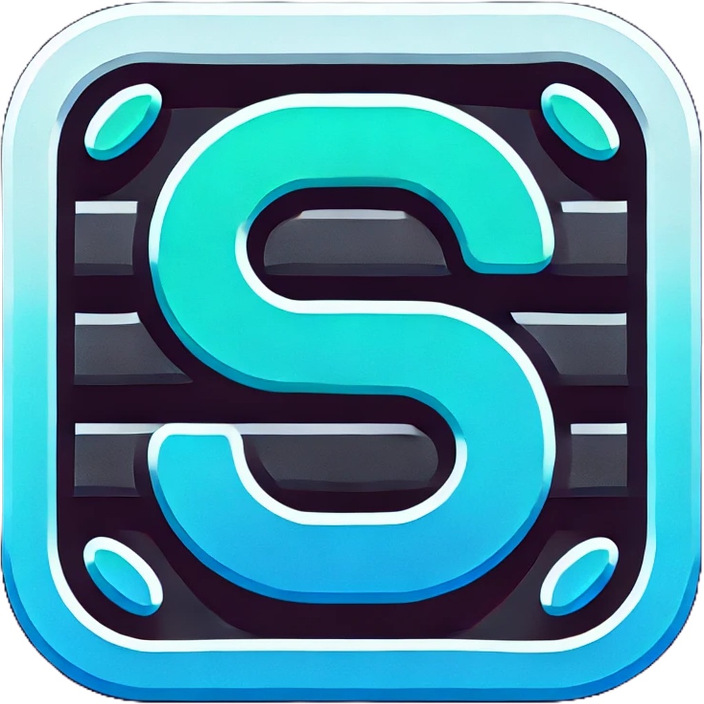

<p align="center">
  <a href="https://github.com/dudushy/shyle">
    
  </a>
</p>

<h3 align="center">Shyle</h3>

<p align="center">
  A modern, responsive CSS framework with custom JavaScript components, inspired by Bootstrap.
  <br>
  <br>
  <a href="https://dudushy.github.io/shyle">Documentation</a>
  ·
  <a href="https://dudushy.github.io/shyle/demo">Demo</a>
</p>

![stars][stars] ![watchers][watchers] ![forks][forks] ![issues][issues] ![pull_requests][pull_requests] ![branches][branches]

---

## Installation

You can install Shyle in your project using either npm or a CDN.

### 1. Via NPM:

Install Shyle using npm to include it as a dependency in your project:

```bash
npm install shyle
```

### 2. Via CDN:

Include Shyle directly from a CDN in your HTML file:

```html
<!-- CSS -->
<link rel="stylesheet" href="https://cdn.jsdelivr.net/npm/shyle@0.1.0/dist/shyle.css">

<!-- JavaScript -->
<script src="https://cdn.jsdelivr.net/npm/shyle@0.1.0/dist/shyle.js"></script>
```

---

## Usage

### 1. CSS

Shyle provides a range of CSS classes to style your components. Here’s a basic example:

```html
<button class="btn">Button</button>
```

### 2. JavaScript

Shyle includes interactive components like Modals and Tooltips. To use them, include the following HTML and the components will be automatically initialized.

#### Modal

```html
<!-- Modal Trigger -->
<button class="btn shyle-modal-trigger">Open Modal</button>

<!-- Modal Structure -->
<div id="shyleModal" class="shyle-modal">
    <div class="shyle-modal-dialog">
        <button class="shyle-modal-close">&times;</button>
        <p>This is a modal!</p>
    </div>
</div>
```

#### Tooltip

```html
<!-- Tooltip Example -->
<button class="btn" data-tooltip="This is a tooltip!">Hover me</button>
```

The modal and tooltip components are automatically initialized when the DOM is loaded. You can customize their behavior by modifying the data attributes or extending the JavaScript classes provided in the `src/ts/components` directory.

---

## Contributing

Contributions are welcome! We appreciate your interest in improving Shyle. Please follow the steps below to get started.

### Prerequisites

Make sure you have Node.js installed. The project requires Node.js `v20.17.0` or higher.

- [Download Node.js `v20.17.0`](https://nodejs.org/download/release/v20.17.0/)

### 1. Fork and Clone the Repository

First, fork the repository and then clone your fork locally.

```bash
git clone https://github.com/your-username/shyle.git
cd shyle
```

### 2. Install Dependencies

Install the necessary packages using npm:

```bash
npm ci
```

This ensures you install exactly the same dependencies as in the `package-lock.json`.

### 3. Start Development

You can start watching for file changes in your TypeScript and SCSS files with:

```bash
npm run watch
```

This command will watch for changes in your TypeScript and SCSS files and automatically compile them to the `dist` directory.

### 4. Build the Project

To build the project for production, run:

```bash
npm run build
```

This will compile the SCSS and TypeScript files into the `dist` directory, optimized for production.

### 5. Clean the Build

If you need to clean the build artifacts, run:

```bash
npm run clean
```

This will remove the `dist` directory and Parcel cache.

### 6. Test Your Changes

Create a simple HTML file to test your changes:

```html
<!DOCTYPE html>
<html lang="en">

<head>
    <meta charset="utf-8">
    <meta name="viewport" content="width=device-width, initial-scale=1">
    <title>Shyle Test</title>
    <link rel="stylesheet" href="../dist/shyle.css">
</head>

<body>
    <!-- Your Shyle components here -->

    <script src="../dist/shyle.js"></script>
</body>

</html>

```

Open this file in your browser to test your changes.

### 7. Submit a Pull Request

Once you’ve made your changes, commit them to your fork, push to your repository, and create a pull request. Be sure to provide a clear description of the changes you’ve made and why they’re beneficial to the project.

---

## License

Shyle is licensed under the MIT License. You’re free to use, modify, and distribute it as you see fit, with attribution.

---

## Useful Links

- [Project Repository](https://github.com/dudushy/shyle)
- [Issue Tracker](https://github.com/dudushy/shyle/issues)
- [Pull Requests](https://github.com/dudushy/shyle/pulls)

---

[forks]: https://img.shields.io/github/forks/dudushy/shyle
[stars]: https://img.shields.io/github/stars/dudushy/shyle
[watchers]: https://img.shields.io/github/watchers/dudushy/shyle
[issues]: https://badgen.net/github/issues/dudushy/shyle
[pull_requests]: https://badgen.net/github/prs/dudushy/shyle
[branches]: https://badgen.net/github/branches/dudushy/shyle
